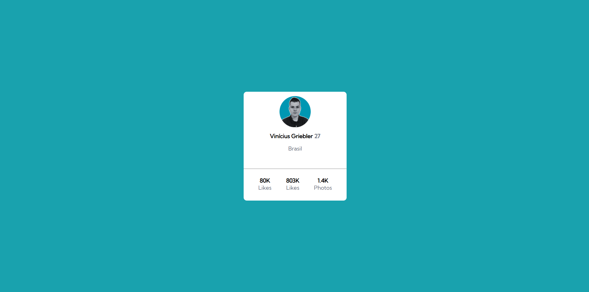

# Card de Perfil

## Esse Projeto foi um exercício do Frontend Mentor, onde o principal desafio foi criar um cartão que contenha informações de perfil para aprimorar minhas habilidades de posicionamento de elementos utilizando FLEXBOX.

## Tecnologias Utilizadas:

 
    
     
    